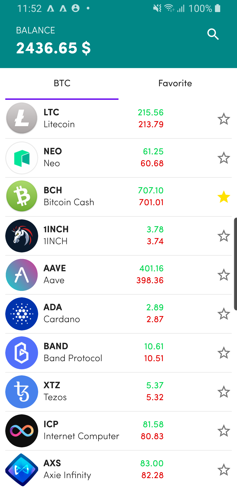
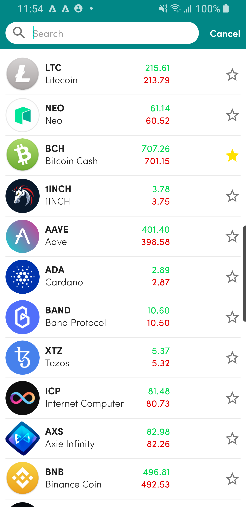

CryptoWallet App
=================

# Description

This project is for technologies showcasing and learning purpose.

# Feature

The app contains 2 screen:

* Home screen: has 2 tabs, one displays a list of Cryptocurrencies, one displays a list of favorite
  Cryptocurrencies.

    

        
    

    

        
    

* Search screen: display a list of Cryptocurrencies with search box allow user to perform search.

 
    

## App Flow

The app will fetch a list of Cryptocurrencies each 30s, the interval logic can be find
in `MainViewModel`, `MainViewModel` implement `LifecycleObserver` to observe Fragment state to
trigger the interval fetching logic when Fragment `onResume` and won't trigger if Fragment `onPause`
, for Fragments which need to trigger the interval refresh logic need to
add `lifecycle.addObserver(mainViewModel)` in `onCreate()`

# Development Environment

The app is written entirely in Kotlin and uses the Gradle build system, You don't need an IDE to
build and execute it but Android Studio is recommended.

1. Download the project code, preferably using `git clone`.
2. Run project using command line or Android Studio

## 1. Android Studio

### Setup

To setup Android Studio, check [this](https://developer.android.com/studio/install)

### Import project

In Android Studio, select `File | Open...` and point to the `./build.gradle` file

### Build and run

To build and run app, check [this](https://developer.android.com/studio/run)

## 2. Command Line

To build and run app using command line,
check [this](https://developer.android.com/studio/build/building-cmdline)

# Architecture

The architecture is build
around [Android Architecture Components](https://developer.android.com/topic/libraries/architecture/)
and follows the recommendations laid out in the
[Guide to App Architecture](https://developer.android.com/jetpack/docs/guide). Logic is kept away
from Activities and Fragments and moved to
[ViewModel](https://developer.android.com/topic/libraries/architecture/viewmodel)s. Data is observed
using [Live Data](https://developer.android.com/topic/libraries/architecture/livedata)

The Repository layer handles data operations. App data will come from a few different sources, user
preferences are stored
in [DataStore](https://developer.android.com/jetpack/androidx/releases/datastore), Cryptocurrencies
data is stored remotely and is fetched and stored in memory for the app to use, etc. - and the
repository modules are responsible for handling all data operations and abstracting the data sources
from the rest of the app.

A lightweight domain layer sits between the data layer and the presentation layer, and handles
discrete pieces of business logic off the UI thread. See the `.\*UseCase.kt` files under `domain`

The [Navigation component](https://developer.android.com/guide/navigation) is used to implement
navigation in the app, handling Fragment transactions and providing a consistent user experience.

[Room](https://developer.android.com/jetpack/androidx/releases/room) is used to implement
the [Single Source of truth](https://developer.android.com/jetpack/guide#truth)

The Dependencies Injection is implemented with [Koin](https://insert-koin.io/)

## Kotlin

The app is entirely written in Kotlin and uses Jetpack's
[Android Ktx extensions](https://developer.android.com/kotlin/ktx).

Asynchronous tasks are handled with
[coroutines](https://developer.android.com/kotlin/coroutines). Coroutines allow for simple and safe
management of one-shot operations as well as building and consuming streams of data using
[Kotlin Flows](https://developer.android.com/kotlin/flow).

# TODO

* Provide Unit/UI Testing.
* Try to go the extra mile and create a real WOW effect UX.